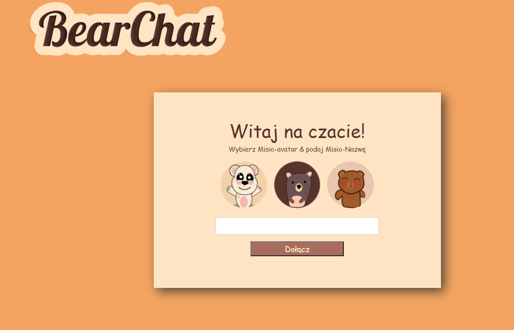
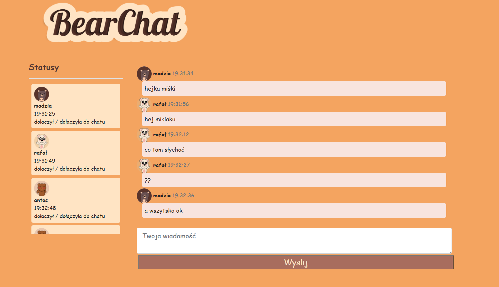
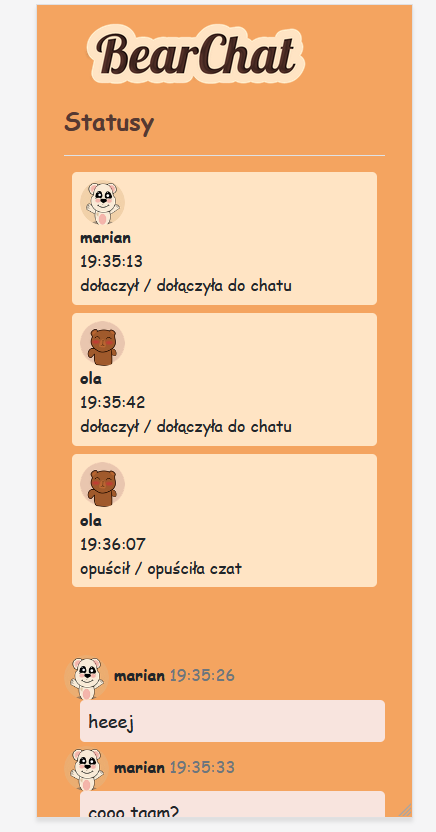
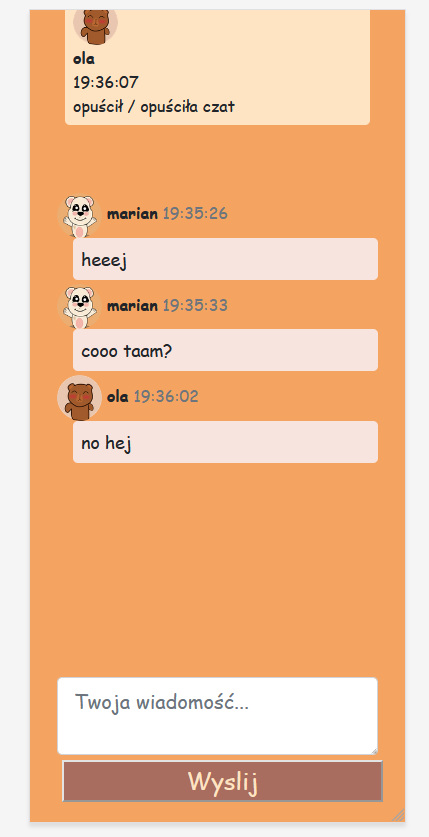

# BearChat - live chat app
A sipmle live chat applictaion with very cute bears motiv - created witch node.js, express, handlebars, bootsrap, Socket.io, jquery

## General info
ChatBear is a simple web application in which users can interact with each other by sending text messages. Each user can choose their login and one of three avatars. The main theme of the application is cute teddy bears. The application was created as a project to train programming skills in node.js 

## Technologies
* node.js 16.9.1
* bootstrap 5.1.3
* express 4.17.1
* handlebars 4.7.7
* jquery 3.6.0
* nodemon 2.0.15
* socket.io 4.4.0

## Setup
To run this project, install it localy using npm:
```
$ cd ../BearChat-main
$ cd npm install
$ nodemon index

```
you can connect as a client on localhost:8080

## Screenshots





## Graphics
logo and teddy bear graphics made by me in a vector graphics program

